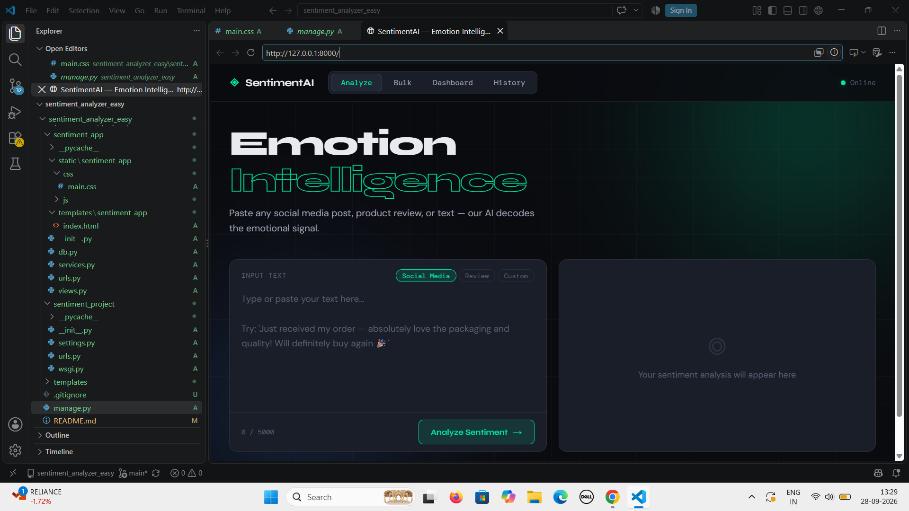
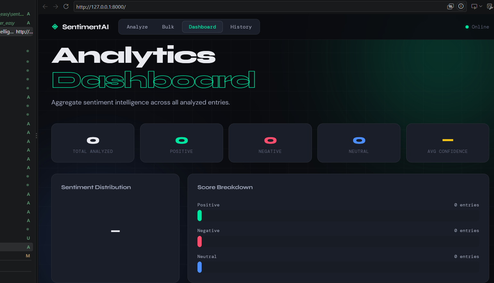
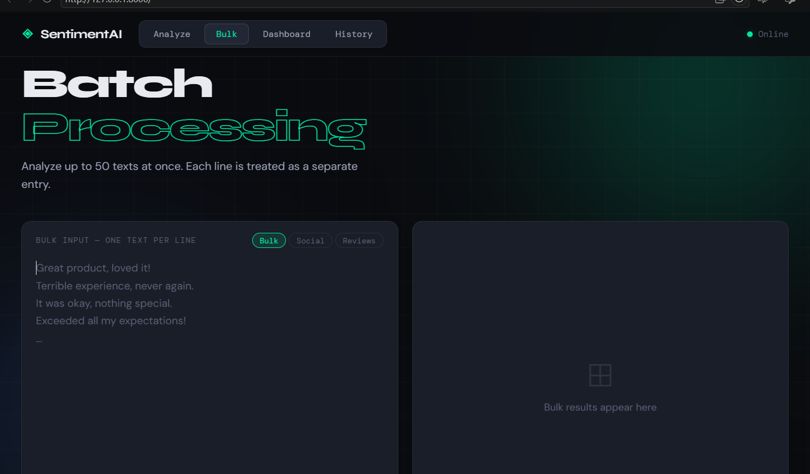
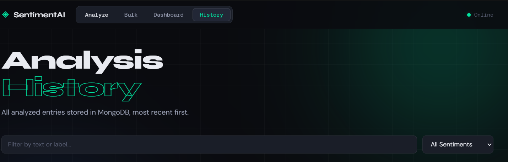

🤖 AI-Based Sentiment Analyzer

A modern web-based Sentiment Analysis application built with Python and Django.
The application analyzes text and classifies it as Positive, Negative, or Neutral, along with confidence scores and sentiment distribution.
It also supports bulk text analysis, sentiment analytics, and analysis history through an interactive dashboard.

---
✨ Features
- 🔍 Single Text Analysis
  Analyze individual text and identify its overall sentiment.
- 📊 Sentiment Classification
  Classifies text into:
  - Positive
  - Negative
  - Neutral
- 🎯 Confidence Score
  Displays a confidence percentage for the predicted sentiment.
- 📈 Analytics Dashboard
  View:
  - Total analyzed texts
  - Positive count
  - Negative count
  - Neutral count
  - Average confidence
  - Sentiment distribution
- 📦 Bulk Analysis
  Analyze up to 50 text entries at once, with one text per line.
- 📝 Analysis History
  View previously analyzed texts and filter results by sentiment.
- 🔄 Reset Data
  Clear all stored analysis results directly from the dashboard.
- 🌐 Multiple Input Sources
  Supports different sources such as:
  - Social Media
  - Product Reviews
  - Custom Text
- 🛡️ Input Validation
  - Empty input validation
  - Maximum 5,000 characters for individual analysis
  - Maximum 50 entries for bulk analysis
---

## 📸 Screenshots

### 🏠 Home


### 📊 Dashboard


### 📦 Batch Analysis


### 📝 Analysis History


🛠️ Tech Stack

Technology| Purpose
Python| Core programming language
Django| Backend web framework
HTML5| Application structure
CSS3| Styling and responsive UI
JavaScript| Frontend interactions and API communication
In-Memory Database| Temporary storage of analysis results

---
🧠 How It Works
The application uses a lightweight keyword-based sentiment analysis approach.

Analysis Flow

User Input
    ↓
Text Preprocessing
    ↓
Positive / Negative Keyword Detection
    ↓
Negation Handling
    ↓
Sentiment Score Calculation
    ↓
Sentiment Classification
    ↓
Confidence Score
    ↓
Store Result
    ↓
Display Result & Analytics
The analyzer maintains positive and negative keyword sets and also handles common negation words such as "not", "never", "don't", and "can't".

---
🚀 Application Modules
1. Sentiment Analysis
Enter any text and click Analyze Sentiment.
The application returns:
Sentiment: Positive / Negative / Neutral
Confidence: XX.X%
Positive Score
Negative Score
Neutral Score

2. Bulk Processing
The Bulk tab allows multiple texts to be analyzed at once.
Example:
I love this product!
The experience was terrible.
The product is okay.
Amazing service and fast delivery!
Up to 50 entries can be processed in a single request.

3. Analytics Dashboard
The dashboard provides an overview of all analyzed entries, including:
- Total analyses
- Positive results
- Negative results
- Neutral results
- Average confidence
- Sentiment distribution
- Score breakdown

4. Analysis History
The History section displays previous analyses and provides filtering by:
- Positive
- Negative
- Neutral

---

📁 Project Structure
```
AI-Based-sentiment-analyzer/
│
├── sentiment_app/
│   ├── services.py          # Sentiment analysis logic
│   ├── views.py             # Django views and API endpoints
│   ├── urls.py              # Application routes
│   ├── db.py                # In-memory data storage
│   └── ...
│
├── sentiment_project/
│   ├── settings.py          # Django configuration
│   ├── urls.py              # Project-level URLs
│   ├── wsgi.py              # WSGI configuration
│   └── ...
│
├── templates/
│   └── sentiment_app/
│       └── index.html       # Main application interface
│
├── manage.py
├── requirements.txt
├── run.sh
├── .gitignore
└── README.md
```

🔌 API Endpoints

The Django application exposes the following endpoints:

Method| Endpoint| Description
"GET"| "/"| Main application
"POST"| "/api/analyze/"| Analyze a single text
"POST"| "/api/bulk/"| Analyze multiple texts
"GET"| "/api/history/"| Retrieve analysis history
"GET"| "/api/stats/"| Retrieve sentiment statistics
"POST"| "/api/reset/"| Clear all analysis data

---

⚙️ Getting Started
Prerequisites
Make sure you have installed:

- Python 3.x
- pip
- Git

1. Clone the Repository
git clone https://github.com/rutujabhosale96/AI-Based-sentiment-analyzer.git
cd AI-Based-sentiment-analyzer
2. Create a Virtual Environment
Windows:

python -m venv venv
venv\Scripts\activate
Linux / macOS:
python3 -m venv venv
source venv/bin/activate
3. Install Dependencies
pip install -r requirements.txt
4. Run the Application
python manage.py runserver
Open your browser and visit:
http://127.0.0.1:8000/
Alternative
You can also use the provided startup script:
bash run.sh

---
📌 Current Limitations

This project currently uses a lightweight keyword-based sentiment engine rather than a trained machine-learning or transformer model.
The analysis data is stored in memory, which means data is cleared when the application process restarts.
For production use, the project could be enhanced with:
- A persistent database
- Machine-learning or transformer-based sentiment models
- User authentication
- REST API documentation
- Automated testing
- Cloud deployment
- Advanced NLP processing

---
🔮 Future Enhancements
- 🤖 Integrate a trained ML / Transformer sentiment model
- 🗄️ Add PostgreSQL or MongoDB for persistent storage
- 👤 Add user authentication and personalized history
- 📱 Improve mobile responsiveness
- 🌍 Support multiple languages
- 📥 Add CSV upload for bulk analysis
- 📤 Export analysis reports
- 📊 Add advanced sentiment visualizations
- 🧪 Add automated unit and integration tests
- ☁️ Deploy the application to a cloud platform
---
🎯 Learning Outcomes
This project demonstrates practical experience with:
- Python programming
- Django web development
- REST-style API endpoints
- Frontend and backend integration
- Text processing
- Sentiment classification
- Data visualization
- Input validation
- Git and GitHub version control
- Basic software project structure
  
👩‍💻 Author
Rutuja Bhosale
GitHub: "rutujabhosale96" (https://github.com/rutujabhosale96)
---
⭐ Project
If you find this project useful or interesting, consider giving it a ⭐ on GitHub.
Built with Python + Django 
